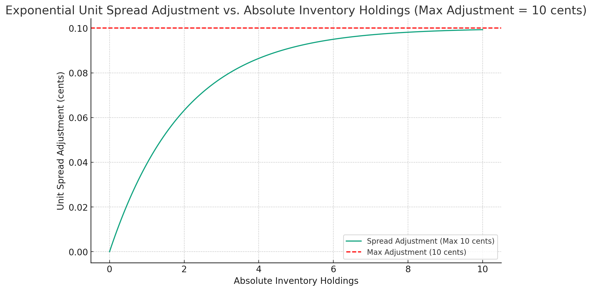
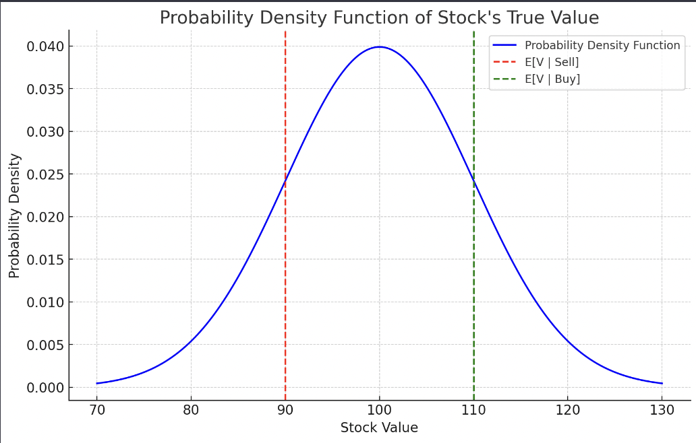

# sophisticated-naive-market-making
a study exploring the efficacy of sophisticated vs naïve market market making in both experimental and real-world environments
_____

# Naïve and Sophisticated Market Making in Experimental and Real Financial Environments
By Miles Child

DRAFT

_____
# Abstract

This study explores the efficacy, measured by trading PnL and aggregate trading volume, of a naïve and a slightly more sophisticated market making strategy. Naïveté, in this study, is defined as making no assumptions about the true value of the underlying security. We deploy these strategies first in an artificial trading environment and second on a real binaries exchange, Kalshi, and find that ***__***. Many studies have been conducted on theoretically efficient market-making techniques both when the market-making agent has and does not have access to exogenous information that can be used to price the underlying asset. Few have applied their market-making techniques in real trading environments. Binary market exchanges like Kalshi present novel pricing environments where the price of any given contract suggests a market-implied probability of that contract's event occurring. In some instances, like [*"Will the end-of-day S&P 500 index value for December 27, 2023 is between 4750-4774.99"*]("https://kalshi.com/markets/inx/sp-500-range#inxd-23dec27"), computing a theoretical probability (price) of a contract is relatively simple by application of primary exchange data. In other instances, like [*"Will Kanye West release a new album on Spotify by Jan 12, 2024?"*]("https://kalshi.com/markets/vultures/new-kanye-album-release-date#vultures), estimation of this probability is considerably more difficult and is much more approximately a low-mean and high-standard deviation jump process where information is rarely, noisily, and violently incorporated into contract prices. As such, spreads (and rewards to agents willing to provide liquidity) tend to be thin on easily-estimated contracts and wide on others. In this study, we attempt to develop a strategy that is efficient at providing liquidity in complex binary environments.

This paper was inspired by the Sanmay Das's thesis *Intelligent Market-Making in Artificial Financial Markets* [1] and some of Das's findings have been recycled here.

# Table of Contents

1. Brief Microstructure Overview
2. The Naïve Market Maker
3. Inventory Control
4. The Sophisticated Naïve Market Maker
5. Artificial Experimental Setup
6. Artificial Experimental Results
7. Real-World Experimental Expectations & Setup
8. Real-World Experimental Results
9. Conclusion
10. References

# Brief Microstructure Overview

I will briefly offer definitions to a few microstructure-related terms here to hopefully avoid any confusion among newer crowds.

- **Market Making:** Posting limit orders at the bid and ask on an asset with the intention of making a large number of trades and profiting as a function of your spread and trading volume. In some scenarios, you may also be rewarded rebates (as a function of trading volume and, sometimes, your spread) from the exchange for providing liquidity.

- **Naïve Market Making:** Market making with no exogenous information about the fair price for the underlying security. For the sake of this paper, I consider a market maker to be naïve if they either don't make any assumptions about the true value of the asset they trade or if they do attempt to make a theoretical true value while being restricted to only orderbook/trading or other orderflow information.

- **Orderbook:** The orderbook we use here is one that tracks all the price levels all market participants have posted limit orders that they are willing to buy or sell at and the subsequent quantities at those levels. Our orderbook uses price-time priority, where the first limit order at the best price wins the first order that crosses that price level.

For simplicity, our trading environment is assumed to be made up of three classes of participants (aside from market makers): 

- **Informed Traders:** Informed traders are assumed to have, at any given time, a perfect notion of the true value of the asset in question. They trade this asset rationally at all times, buying when the best ask is below the true value and selling when the best bid is at or above the true value. Informed traders are toxic to market makers because they will only do business when the market maker's bid or ask is above / below the true value.

- **Gaussian Informed Traders:** Gaussian informed traders are a slight modification of informed traders and are assumed to have, at any given time, a noisy signal $S$ regarding the true value $V_T$ of the underlying stock that can be represented as $S = V_T + \mathcal{N}(0, \sigma)$, where $\mathcal{N}(0, \sigma)$ is a sample from a normal distribution with mean 0 and variance $\sigma^2$. They will trade about the best bid and ask in the same manner as informed traders, but due to the noisiness of their $V_T$ signal, it is possible for them to buy when the best offer is actually above the true value (or sell when the best bid is below the true value). We will use Gaussian informed traders as a substitute for actually-informed traders because they probably represent the real-life informed trading class more accurately than perfectly informed traders.

- **Gaussian (or noisy) Traders:** Gaussian traders trade about the best bid and ask in the same way as Gaussian informed traders but their $V_T$ signal is pure noise. In other words, they have, at any given time, a noisy signal $S$ regarding the true value $V_T$ of the underlying stock that can be represented as $S = \mathcal{N}(0, \sigma)$, where $\mathcal{N}(0, \sigma)$ is a sample from a normal distribution with mean 0 and variance $\sigma^2$. This trading class trades completely at random and has no accurate notion of the true value at any given time.

# The Naïve Market Maker (NMM)

The naïve market-making strategy we use here is an adaptation of the kalshi-adapted python NMM that can be found at the github repository [here]('https://github.com/milesChild/kalshi-naive-market-maker'). The NMM is a simple liquidity provider whose goal is to always post a bid and ask on a single security with a fixed spread and a fixed trading quantity that the user defines at runtime. the naïve market maker is initialized with a fixed spread ***σ*** that is symmetrical about the market's last trading price $P_{last}$, where:

$P_{bid}$ = $P_{last} - σ / 2$

$P_{ask}$ = $P_{last} + σ / 2$

The NMM's behavior will be the same regardless of the volatility of the underlying asset, the presence of other market-making agents, or the underlying portfolio exposure. This model is very simple to implement but has an extensive list of clear flaws that would likely prevent its ability to achieve positive or Nash PnL in most (if not all) trading environments. The NMM's most critical flaws are as follows: 

(1) Bid and ask will always be a lagging indicator of "true value" because the NMM's bid/ask placement only moves as a function of the last trading price. This means that in times of price discovery, the NMM's price adjustment will at best be linear while informed traders continously lift the toxic side of the spread.

(2) In competitive environments with other market-making agents, the NMM's behavior can easily be learned and exploited to ensure it only wins trades when flow is toxic. For example, in times where the true value is approximately known, other agents can constantly maintain the maximum spread that is tighter than the NMM's. In times of information volatility when there is an unknown delta in the true value, other agents can widen their spreads so the NMM wins every trade and bears the brunt of all the informed trading and subsequent PnL losses. Then, when the true value becomes less uncertain, spreads can again be tightened.

(3) In an environment with no competition and *any* presence of informed traders, we can always expect the NMM to have negative PnL as spreads are not dynamic to changes in true value uncertainty and inventory will always be accumulated in the toxic direction during times of price discovery.

(4) The NMM is not proactive about mitigating inventory exposure and incentivizing turnover. We can thus expect PnL to be an inverse function of inventory accumulation in the presence of informed traders.

To address the NMM's position exposure and inefficient pricing adjustment flaws, we will introduce a simple inventory-control mechanism below before discussing the sophisticated naïve market-maker.

# Inventory Control

As any market-making agent provides liquidity, it will tend to accumulate a positive or negative position in the underlying asset that can interfere with its ability to remain market-neutral and generate consistent liquidity reward revenues. This accumulated position of shares, either long (positive) or short (negative), is called inventory and it is generally in our best interest to maintain zero inventory while maximizing trading volume. Thus, we need an inventory control mechanism that makes it increasingly difficult to buy shares and easy to sell shares when our inventory is long and the opposite when inventory is short.

Spread placement is improved via the below inventory control mechanism, which computes an adjustment (in cents) to apply to both sides of the spread that effectively makes accumulating inventory in the direction (long/short) of current inventory increasingly difficult up to a parameterized maximum amount. 

The inventory control mechanism is as follows:

$f(i) = -sign(i) \times M \times \left(1 - e^{-a \times |i|}\right)$

Where,

- $f(i)$ is the spread adjustent in cents

- $M$ is the maximum allowed spread adjustment in cents

- $i$ is the integer value of current inventory holdings (negative for short)

- $a$ is a scaling factor for the exponential function

For example, when the max adjustment is set to 10 cents and $a$ is set to 0.5, the inventory control mechanism as a function of absolute inventory holdings would be as follows:

# The Sophisticated Naïve Market Maker

A more sophisticated NMM would be able to widen spreads (to avoid negative positional PnL) when the true value of the underlying asset is more uncertain and tighten them (to perform better in competition) when the true value is more certain. In order to do so, the sophisticated NMM would have to make two advancements over the NMM: (1) maintain a sense of the true value of the underlying asset while only using order flow data, and (2) incorporate that true value estimation into the bid $P_b$ and ask $P_a$ prices at every timestep. Das introduces a method of accomplishing this in *Intelligent Market-Making in Artificial Financial Markets* [1] that we will explore below.

Das explores the possibility of deriving optimal bid and ask prices by using an online probability density estimator that stores, for each possible asset price level, the market maker's probability assumption that the true value $V_T$ is equal to that price level. It exploits the informativeness of each trade the market maker observes to update this probability density estimation. For example, when a buy order occurs, it becomes more likely that the $V_T$ is higher than the market maker initially assumed before that buy order occurred (and conversely lower for sell orders). In accordance with Nash equillibrium, Das suggests we set the bid and ask prices equal to our expectation of the true value given the type of order we've received.

Our $P_b$ should be equal to the expected $V_T$ given the order we've received is a sell order:

$P_b = E[V|Sell]$

Our $P_a$ should be equal to the expected $V_T$ given the order we've received is a buy order:

$P_a = E[V|Buy]$

Before detailing the approximations for $E[V|Sell]$ and $E[V|Buy]$ we will use, let's consider a trivial example of how this model can be used to compute the $P_b$ and $P_a$. We will assume a normal probability density price vector $\mathcal{N}(EV, \sigma)$ with mean $EV$ and variance $\sigma^2$. Assume we have access to two equations, $f_1$ and $f_2$ that allow us to calculate the $P_b$ and $P_a$, respectively. 

Assume a mean value of 100 and standard deviation 10. For simplicity, assume the $P_b$ and $P_a$ have been computed summetrically about the mean at 90 and 110. The market maker's bid and ask price about its probability density estimate can then be illustrated like:

Before detailing the two mechanisms required for this $V_T$-based pricing mechanism, we need to establish a few assumptions about the trading environment:

- We need to make an assumption about the proportion of all traders that are noisy and informed, which will be denoted by $\alpha$
- We need to make an assumption about the standard deviation of the gaussian informed traders information signal noise, denoted by $\sigma W^2$
- We need to make an assumption about the base probability of an order occurring at any given time (how often gaussian traders make trades), denoted by $\eta$
- Finally, we need the initial true value of the security at the beginning of the simulation, denoted by $V_{T0}$

The full derivations for the bid and ask prices will not be detailed here but those interested can read about them in Das's paper linked in references.

First, Das's equation for the optimal bid price is:

$P_b = \frac{1}{P_{\text{Sell}}} \left( \sum_{V_i = V_{\text{min}}}^{P_b} ((1 - \alpha) \eta + \alpha) V_i \cdot Pr(V = V_i) + \sum_{V_i = P_b + 1}^{V_{\text{max}}} ((1 - \alpha) \eta) V_i \cdot Pr(V = V_i) \right)$

Where:

- $P_{Sell}$ is the total probability of a sell order occurring. It's calculated by summing the probabilities of a sell order for each possible value of $V$
- $V_i$ is The possible values of the security, ranging from a minimum $V_{min}$ to a maximum $V_{max}$ value which, in our case, is every integer from 0 to 100 (this is how binaries are priced on Kalshi).
- And $Pr(V = V_i)$ is obtained from the probability density vector that we will describe shortly

The first summation calculates the expected value of the security for values from the minimum possible value to the bid price. This part uses a weight of $((1-\alpha)\eta + \alpha)$ because all gaussian informed traders that are not making bad trades (as a result of high noise) and the typical random amount of gaussian traders will sell when the true value is below the bid price. The second summation calculates the expected value for values above the bid price up to the maximum value. This part of the equation uses a weight of $(1-\alpha)\eta$ because it considers only the uninformed traders who might still sell even when the true value is above the bid price. These uninformed traders are assumed to act without special insight into the true value of the security.

Similarly, for the ask price:

$P_a = \frac{1}{P_{\text{Buy}}} \left( \sum_{V_i = P_a}^{V_{\text{max}}} ((1 - \alpha) \eta) V_i \cdot Pr(V = V_i) + \sum_{V_i = V_{\text{min}}}^{P_a - 1} ((1 - \alpha) \eta + \alpha) V_i \cdot Pr(V = V_i) \right)$

The probability density estimate is first initialized as a normal distribution about the initial true value, $V_{T0}$. We store the probability density estimates as a vector of the probabilities that the true value is equal to the price $i$ for all $i$ from 0 to 100 (to represent every possible price level on Kalshi binaries). The vector is then updated after every new order for all $i$ based on the type of order received. The full derivations of these equations will not be described here but readers are encouraged to see them in Das's paper linked in references.

If a buy order is received, each of the probabilities get updated with the following Bayesian update formula:

$Pr(V = V_i | \text{Buy}) = \frac{Pr(\text{Buy} | V = V_i) \cdot Pr(V = V_i)}{Pr(\text{Buy})}$

When $V_i \leq P_a$:

$Pr(\text{Buy} | V = V_i) = (1 - \alpha)\eta + \alpha \cdot Pr(\tilde{\eta}(0, \sigma_W^2) > (P_a - V_i))$

Here:

- $Pr(V = V_i | \text{Buy})$ is the posterior probability, which is the updated belief about the true value being $V_i$ after observing a buy order.
- $Pr(\text{Buy} | V = V_i)$ represents the likelihood of observing a buy order given the true value $V_i$. This likelihood is influenced by both informed and uninformed traders in the market.
   - For informed traders (represented by $\alpha$), the likelihood considers the probability that their noise-adjusted estimate of the true value ($\tilde{\eta}(0, \sigma_W^2)$) is greater than the difference between the ask price $P_a$ and the true value $V_i$. This reflects the informed traders' propensity to buy when they believe the security is undervalued.
   - For uninformed traders (represented by $(1 - \alpha)\eta$), the base probability $\eta$ of a trade happening is used, as these traders are assumed to trade randomly and not based on an informed estimate of the true value.
- $Pr(\text{Buy})$ is the total probability of a buy order occurring, summed over all possible values of $V$.

And when $V_i > P_a$:

$Pr(\text{Buy} | V = V_i) = (1 - \alpha)\eta + \alpha \cdot Pr(\tilde{\eta}(0, \sigma_W^2) < (V_i - P_a))$

Updating based on a sell order follows the exact same logic.

Now, we have a more sophisticated naïve market maker that maintains a dynamic spread based on its estimation of the point-in-time true value of the underlying security given observed order flow. We also equip the aforementioned inventory control mechanism to the sophisticated NMM to incentivize inventory turnover and mitigate positional PnL. The inventory control adjustment is applied to the bid and ask prices after the above $P_b$ and $P_a$ equations are run.

We can expect this evolution of the naïve market maker to be much more effective in competitive environments, more responsive to deltas in the true value of the underlying security, and considerably better at tracking the true value of the underlying security. We will test these expectations in the proceeding sections.

# Artificial Experimental Setup

The artificial experimental framework is setup as follows: a single or multiple market makers are dropped at the first auction in a contrived single-security universe with $N$ total auctions and $M$ total market-making agents. The market making agents are unaware of the total number of auctions or the presence of other market makers. The single security has a true-value at all times that is governed by a jump process where at time $i + 1$, with probability $p$, a delta is applied to the true value of the security where $V^{i + 1} = V^i + \tilde{\omega}(0, \sigma_J)$, where $\tilde{\omega}(0, \sigma_J)$ is a sample from a normal distribution with mean 0 and variance $\sigma_J^2$. Each experiment will have gaussian-informed traders in proportion $\alpha$ to the total trading population (less the market-making agents) where the gaussian-informed traders recieve signals about the true value of the stock $W^i = V^i + \tilde{\eta}(0, \sigma_W)$ where $\tilde{\eta}(0, \sigma_W)$ represents a sample from a normal distribution with mean 0 and variance $\sigma_W^2$. We also introduce purely-Gaussian traders to the experiment in proportion $(1 - \alpha)$ where at any given time they have a probability $\eta$ of placing a trade. The market-making agents are provided with the true value at the first action and are not notified of changes to the true value thereafter. Market-making agents are also aware of all the other variables defined above that govern the behavior of all other market participants. The total number of trading participants is a global variable $T$ where $\alpha + (1 - \alpha) = T$.

At each auction, the Gaussian traders trade randomly with probability $\eta$ and the Gaussian-informed traders trade rationally under the assumption that their noisy signal is correct. Note that adaptations to this unrealistic setup will be deliberated and made in the following sections when we deploy these market makers in real environments. Values for the above variables will be sensitized and the resulting SNMM and NMM performances will be reviewed below aross various experiments. For each experiment, the values used can be found in the appendix. The code used to run these experiments can be found in the ***articial/*** directory.

# Artificial Experimental Results

First, we will compare the trading efficiency of the NMM versus the sophisticated NMM in an anticompetitive, single market-maker environment with the following variables:

**Experiment #1**

**SEE artificial/src/experiment_1.ipynb**

# Real-World Experimental Expectations & Setup

# Real-World Experimental Results

# Conclusion

# References

[[1]]('https://dspace.mit.edu/bitstream/handle/1721.1/87351/53225588-MIT.pdf;sequence=2') Das, S. (Year). Intelligent Market-Making in Artificial Financial Markets.
